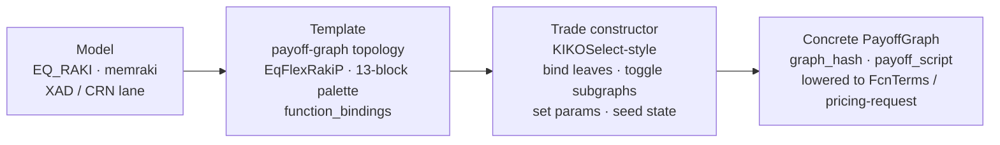

# FinA Visual Builder

Use this skill to treat a structured product as an assembly of **typed payoff blocks** rather than a monolithic pricing script. The canonical compiled artifact is the payoff graph emitted by `fina-core` (`python/fina_core/payoff.py`, `fina/payoff-graph/v1`); the visual builder is the design-time and diagnostic surface over that graph.

## Lego-block mental model

Think in the same way as two familiar construction systems:

- **Layout legos** — a page is a header block, a nav block, a content block, and a footer block. Each block has fixed *studs* (slots) it can receive and *pegs* (ports) it emits; you can only snap compatible pieces together.
- **Swap legos** — a fixed leg and a floating leg snap together because both expose the same notional, currency, and schedule interface. The interface is what makes them swappable, not the rate logic inside them.

A structured product is built the same way. Every payoff node declares:

1. **Typed input ports** — what it consumes (a path observation, a worst-of performance, a gate state, a cash-flow vector).
2. **Typed output ports** — what it emits to the next block.
3. **Config** — its parameter form (barrier, strike, rate, bounds, calendar, delivery type).
4. **State** — its read/write lifecycle memory (KI hit, KO hit, unpaid fixings, locked underlyings).
5. **Kernel binding** — the `fina_risk_cpp` function that evaluates it, and its AAD/smoothing eligibility.

The palette stays **closed and vetted** (the 13 block kinds below), so a drag-and-drop editor can type-check wiring, reject illegal connections, and lower the assembled DAG to both the fast compiled kernel and the per-path trace.

## Three layers: model / template / trade

A structured product is not "a model." It is a **shared model**, a **shared template**, and a **per-trade instantiation record**. Keeping these three layers distinct is what lets one engine serve many trades without cloning anything.

| Layer | What it is | Scope | Examples | Changes when |
|---|---|---|---|---|
| **Model** | Pricing model group, calibration, and numerical lane | Shared across products | `EQ_RAKI`, `memraki`; XAD fixed-branch vs CRN-fallback lane; vol/correlation model | The model or calibration convention changes |
| **Template** | Payoff-graph **topology** — nodes, edge roles, and kernel bindings emitted by `compile_payoff_graph` | Shared per structural variant | `EqFlexRaki` vs `EqFlexRakiP`/`EqFlexMemRP`, `ELIFCN_KI`; the 13-block palette and `function_bindings` | A block kind or edge role is added/removed, i.e. **topology** changes |
| **Trade** | Binding + activation + parameters + lifecycle state that instantiates a template into a concrete graph | Per deal | `KIKOSelect`-style record: underlyings, reference prices, barriers, rates, schedules, `LKO/GKO Locked`; outputs `graph_hash` + `payoff_script` | Every trade |



Rules:

- A different **barrier, rate, strike, schedule, basket member, or reference price** is trade data. It never justifies a new model or template.
- A different **feature toggle** (`localKO`, `globalKO`, `knockIn`, `memory`, `ITMPayment`) is still trade data **when the template declares that activation**; it selects a subgraph of the same template.
- Only a difference the template cannot express — a **new block kind or edge role** — earns a new template. Memory KO vs non-memory is the canonical example (`EqFlexRakiP` vs `EqFlexMemRP`).

## History: RAKI → RakiPlus → visual blocks

The block model did not start as a UI metaphor; it came out of a booking-layer problem.

- **RAKI v1** (`EqFlexRaki`, model group `EQ_RAKI`): the basket was a **pre-defined market object**, so a separate Murex basket had to exist for every stock combination. `KIKOSelect` existed but was thin — feature activation (LKO/GKO/KI), `returnRatio`, and initial fixings only. Basket maintenance grew roughly as `C(N, k)` for universe `N` and basket size up to 6, an operational dead end.
- **RakiPlus / MemRakiPlus** (`EqFlexRakiP` / `EqFlexMemRP`): a market-level **dummy basket** placeholder replaces the per-combination object, and the trade's real constituents and reference prices move **into `KIKOSelect` of the trade**. `KIKOSelect` grows into a per-trade **constructor**: it binds leaves, toggles subgraphs, selects settlement, adds `Denomination` rounding and quanto FX fixing, and seeds memory-lock state (`LKO Locked`, `GKO Locked`).
- **Visual block builder**: makes that constructor role explicit. A `KIKOSelect`-style binding/activation record instantiates the shared 13-block palette; drag-and-drop binds leaves and toggles optional subgraphs, and only a **topology-changing** difference (memory KO vs non-memory) earns a new template.

| Aspect | RAKI v1 | RakiPlus / MemRakiPlus |
|---|---|---|
| Basket | Pre-defined market object per combination | Dummy placeholder + trade constituents |
| `KIKOSelect` role | Thin: feature toggles, `returnRatio`, initial fixing | Constructor: binds leaves, toggles, settlement, rounding, FX, lock seed |
| Basket maintenance | `C(N, k)` objects | One dummy basket per market |
| DAG construction | Split: graph needs an external basket object | Self-contained per trade |
| Extra nodes | — | `Denomination` rounding, FX fixing, memory-lock seed |

The two reference diagrams share the same node vocabulary; the difference is exactly which block supplies the worst-of leaves and what the constructor block activates: [refs/Raki.md](refs/Raki.md) vs [refs/RakiPlus.md](refs/RakiPlus.md).

## Target DAG (all 13 block kinds)

**Layer: template.** This is the maximal topology — the union of every block the FCN/ELI template can express, including mutually exclusive branches (`cash` and `physical`, `local_ko` and `global_ko`). It is not a trade. A concrete **trade-layer instance** is the bound/toggled subgraph emitted by `compile_payoff_graph`: leaves bound, optional gates toggled, config filled, lifecycle state seeded, sealed by `graph_hash`.

```mermaid
flowchart LR
  subgraph INPUT["Inputs / Market legos (typed ports)"]
    MKT["MarketSnapshot<br/>spots · curves · vol surface · correlation"]
    PATH["PathCube<br/>S(t, path) per step"]
    LIFE["LifecycleState<br/>already_knock_in · locked[] · memory"]
  end

  subgraph SCHED["Schedule lego"]
    FS["fixing_schedule<br/>NYSE calendar · observation dates t_i"]
  end

  subgraph REDUCE["Basket reduction lego"]
    WOP["worst_of_performance<br/>w_t = min_i(S_i(t)/S_i(0))"]
  end

  subgraph GATES["Gate / state legos (differentiability-aware)"]
    KI["knock_in_gate<br/>EKI · final fixing · w_T <= K_KI"]
    GKO["global_ko_gate<br/>all names >= K_KO · american · memory"]
    LKO["local_ko_gate<br/>per-period KO"]
  end

  subgraph COUPON["Coupon legos"]
    RA["range_accrual<br/>L <= w_t <= U"]
    CS["coupon_strip<br/>per-period rate · N2-N1 · memory"]
    MC["memory_carry<br/>unpaid fixings -> later periods"]
  end

  subgraph PAYOFF["Payoff / settlement legos"]
    DIP["down_and_in_put<br/>strike K · KI-gated"]
    NR["notional_return<br/>par redemption"]
    CASH["cash_settlement<br/>cash-settled put"]
    PHYS["physical_delivery_settlement<br/>worst-name delivery"]
    DISC["payment_discount<br/>curve · Actual/365 · lag"]
  end

  subgraph OUTPUT["Final payoff script"]
    AGG["aggregate_legs<br/>Σ sign · leg PV<br/>PUT/FUNDING/COUPON"]
    SCRIPT["payoff_script<br/>rendered decomposition + per-path final payoff"]
  end

  MKT --> PATH
  PATH -->|"obs t_i"| FS
  FS -->|"t_i"| WOP
  PATH -->|"S_i(t)"| WOP
  LIFE -.->|"state seed"| KI
  LIFE -.->|"state seed"| GKO
  LIFE -.->|"memory seed"| MC

  WOP -->|"w_t"| KI
  WOP -->|"w_t"| GKO
  WOP -->|"w_t"| LKO
  WOP -->|"w_t"| RA
  WOP -->|"w_T"| DIP

  LKO -->|"terminates period"| RA
  RA -->|"in-range count"| CS
  CS -->|"unpaid"| MC
  MC -->|"carry (state feedback, unrolled in time)"| CS

  KI -->|"activates on EKI"| DIP
  GKO -->|"terminates"| CS
  GKO -->|"terminates"| DIP
  GKO -->|"call redemption"| NR

  DIP -->|"KI branch"| CASH
  DIP -->|"delivery flag"| PHYS
  CASH -->|"cash flow"| DISC
  PHYS -->|"notional - put"| DISC
  NR -->|"par"| DISC
  CS -->|"coupon PV"| DISC

  DISC -->|"discounted per-path cashflows"| AGG
  AGG --> SCRIPT
```



## Where the payoff script sits

`payoff_script` is **not an input to the calculation**; it is the **rendered decomposition of the assembled DAG**, attached to the graph and displayed as the caption over the final aggregation:

```text
worst-of { - put(EKI 0.7, strike 0.78, physical_delivery);
           + notional_return(1x);
           + coupon_strip(0.009642, WPS, N2-N1, memory) }
  gates: EKI(0.7, final_fixing) + global_ko(1.1, >=) terminates coupon+put
```

- **Design time:** the editor regenerates `payoff_script` from the nodes/edges, so the user always sees the assembled product in one line. `graph_hash` seals the exact wiring for cache keys and diffing.
- **Run time (per path):** `aggregate_legs` produces the signed sum of discounted leg cash flows — the finalized payoff for that path. The script is the label; the aggregate is the value.
- **Animation:** the path scrubber replays `SCRIPT`'s terms lighting up as `AGG` accumulates, so the payoff is seen to "finalize" at `final_fixing_date`.

## Block catalog (target contract)

| # | Block kind | Role | Key typed ports | State read/write | Kernel binding |
|---|---|---|---|---|---|
| 1 | `fixing_schedule` | Observation calendar | in: PathCube, calendar · out: `t_i[]` | — | `observation_on_or_before` (schedule.hpp) |
| 2 | `worst_of_performance` | Basket reduction | in: `S_i(t)` · out: `w_t` | — | `price` (engine.hpp) |
| 3 | `knock_in_gate` | EKI barrier | in: `w_T`, `K_KI` · out: `ki_hit` | write KI | `update_knock_in` (terminal_option.hpp) |
| 4 | `global_ko_gate` | Call / global KO | in: `w_t`, `K_KO` · out: `ko_hit`, `call_date` | write KO | `resolve_ko` (barriers.hpp) |
| 5 | `local_ko_gate` | Per-period KO | in: `w_t`, local barrier · out: `period_live` | write local KO | `resolve_ko` (barriers.hpp) |
| 6 | `range_accrual` | Range observation | in: `w_t`, `L`, `U` · out: `in_range` | write fixings | `in_range` (coupon.hpp) |
| 7 | `coupon_strip` | Coupon periods | in: `in_range`, rate · out: `coupon_cf[]` | read memory | `period_rate` (coupon.hpp) |
| 8 | `memory_carry` | Unpaid coupon memory | in: unpaid · out: carried | read/write memory | `next_memory` (coupon.hpp) |
| 9 | `down_and_in_put` | KI-gated put | in: `w_T`, `K`, `ki_hit` · out: `put_cf` | read KI | `terminal_option_payoff` (terminal_option.hpp) |
| 10 | `notional_return` | Principal redemption | in: KO state · out: `funding_cf` | read KO | `funding_amount` (funding.hpp) |
| 11 | `cash_settlement` | Cash settlement | in: put intrinsic · out: cash | read KI | `settlement_for` (settlement.hpp) |
| 12 | `physical_delivery_settlement` | Worst-name delivery | in: `w_T` · out: delivery legs | read KI | `settlement_for` (settlement.hpp) |
| 13 | `payment_discount` | Date discounting | in: `cf[]`, dates · out: `pv` | — | `price` (engine.hpp) |

## Execution and tracing rules

- **Compiled lane:** lower the DAG to `FcnTerms` and run the fused kernel across all paths (fast, no traces). This is the production path.
- **Traced lane:** interpret the same DAG topologically for one selected path and emit `{path_id, step, node_id, inputs, output, gate_state, cumulative_pv}` per node. This trace is the animation dataset.
- **Parity gate:** traced output must equal the compiled output for the same path under common random numbers (`seed 1729`) before a trace is shown.

## Anti-patterns

This section is the guardrail checklist. Each entry is a way the Lego contract or the model/template/trade separation gets violated, what breaks, and the fix. The compiler enforces the structural ones at compile time; the rest are review gates.

| Anti-pattern | Symptom | Why it breaks | Fix |
|---|---|---|---|
| `payoff_script` treated as the source of truth | Script and recompiled graph drift | The script is *derived*; editing it changes nothing in the DAG | Derive `payoff_script` from nodes/edges; seal with `graph_hash` |
| Wiring market data straight into a gate or payoff | Wrong basket semantics; single-name behavior | Bypasses basket reduction | Only `worst_of_performance` binds leaves; every gate consumes `w_t` |
| Binding different block kinds to one whole-engine symbol | Block is not independently evaluable; cannot swap or trace | The block stops being a unit and becomes a label | One kernel per node kind; keep `price()` for orchestration/aggregation |
| Free-form wiring / open palette | Illegal DAGs (global KO + coupon-barrier memory; un-unrolled cycles) reach the engine | No type or constraint checking | Closed palette + typed ports + compile-time validation |
| A new model or template per trade | `C(N, k)` template/basket explosion; ops unmaintainable | Trade variation leaks into shared layers | Keep variation as trade-layer data; add a template only for topology change |
| Toggling features by editing topology instead of the activation record | Graphs are not reproducible; `graph_hash` unstable | Construction logic lives in the editor, not the trade | Express toggles as declarative activation fields on the constructor |
| Showing a trace that was not parity-checked | Animation PV disagrees with production | The trace runs a different code path | Gate display on CRN parity (`seed 1729`) with the compiled lane |
| Filling undocumented behavior with a convenient default | Silent wrong PV | KO/KI precedence, missing fixings, and endpoint inclusivity are policy | Mark ambiguous; require a fixture or config, never assume |
