# Model layer and trade layer — visualisation study

Draft study. The main [SKILL.md](../SKILL.md) visualises the **template** layer: the
13-block payoff DAG, the `KIKOSelect`-style constructor, and the RAKI → RakiPlus
history. It does not visualise the two layers that sit on either side of it:

- the **model** layer — model group, calibration, numerical lane, evidence gate;
- the **trade** layer — binding, activation, lifecycle, and the dated cash-flow record.

This document studies how the two layers *actually* look inside the `fina-risk` C++
pricing lane, and proposes one mermaid diagram per concern. Every diagram is annotated
with the code that justifies it, so a diagram can be refuted by a compiler error.

## What was studied

| Source | What it fixes |
|---|---|
| `modules/fina-skills/model-registry/{fcn,range-accrual,reverse-kiko}.yaml` | what a "model" is registered as: model group, calibration, backend, risk profile, evidence gate |
| `modules/fina-risk/cpp/CMakeLists.txt` | the optional adapter switches that select a lane at build time |
| `modules/fina-risk/cpp/src/fina_risk_cpp.cpp` | the four native lanes: `run_cpp_parity`, `price_fixture`, `run_daily_termsheet[_batch]`, `run_fcn_rakiplus_json` |
| `modules/fina-risk/cpp/src/fina_risk/engine.cpp` | the canonical lifecycle kernel: `compile_canonical_terms` → `price` → `assemble_json` |
| `modules/fina-risk/cpp/apps/aad_benchmark.cpp` | the XAD / CRN hybrid lane and its transition detection |
| `modules/fina-risk/src/fina_risk/{hybrid,aad}.py` | the per-risk-cell method selection rule |
| `modules/fina-core/python/fina_core/payoff.py` | the template emitter and its two lowerings |
| `modules/fina-risk/skills/fina-risk/refs/{lane-checkpoint,aad-barrier-capability-assessment,uniqueness-factor-compression-and-aad}.md` | lane inventory, Greek capability matrix, honest-method labels |

## Conventions used in this document

The existing diagrams set the house style; the new ones follow it.

- `flowchart LR` with one `subgraph` per layer, ` ` line breaks, every label quoted.
- **Thick `==>`** for a binding (the `KIKOSelect ==> worst_of_performance` precedent).
- **Solid `-->`** for data / state flow.
- **Dotted `-.->`** for config, provenance, or read-only reference.
- **Dotted `==>`** for evidence / parity gates that can veto a whole subgraph.
- `stateDiagram-v2` is used once, for the per-path lifecycle, because a lifecycle is a
  state machine and a flowchart would lie about it. This is the only deliberate
  deviation from the flowchart-only convention.
- A `pie` chart is used once, for the model's population view, because that is
  population data and not a wiring graph.

---

# Part 1 — Model layer

## 1.1 What a "model" is here

A model is **not** the product. It is the answer to four questions that are shared by
every trade in a product family:

1. **Which model group** does the family belong to?
2. **How is the market calibrated** for this family?
3. **Which numerical lane** and **which differentiation method** are admissible?
4. **What evidence** allows the result to be published?

`modules/fina-skills/model-registry/fcn.yaml` is exactly that record, and it is already
the natural unit of visualisation:

| Question | Field | `fcn.yaml` | `range-accrual.yaml` |
|---|---|---|---|
| Model group | `flex.model_group` | `memraki` (`:12`) | `EQ_RAKI` (`:12`) |
| Maturity of the wiring | `status` | `executable` (`:8`) | `design` (`:8`) |
| Market calibration | `market_data.required` | 6 required inputs, `NYSE`, `daily` (`:116-126`) | 6 required inputs, `product-specific` (`:60-70`) |
| Reference backend | `pricing.backends.reference` | `fina_risk.daily_termsheet`, `allowed_for: oracle-conformance` (`:130-136`) | `pending-range-accrual-oracle`, `conformance-only` (`:74-78`) |
| Production backend | `pricing.backends.native` | `fina_risk_cpp.run_daily_termsheet`, `engine_marker: cpp_daily_termsheet_eki`, `fallback_allowed: false` (`:137-147`) | `pending-daily-range-accrual-entrypoint`, `engine_marker: pending` (`:79-86`) |
| Numerical conventions | `pricing.path_count / seed / bump` | `30000 / 1729 / 0.01` (`:148-150`) | — |
| Risk profiles | `risk_profiles.quote / eq-delta / full-trading` | `PV` · `central_bump_revalue` · `pending-complete-risk-profile` (`:157-169`) | `pending` (`:87-94`) |
| Evidence gate | `evidence.status / required_engine_marker / checks / tolerances` | `verified`, 8 named checks, `pv 1e-10` / `greek 1e-8` (`:170-186`) | `pending` (`:100-107`) |

Two things follow immediately and both are visual rules:

- The model group is a **shared, versioned registry key**, not a trade attribute. Two
  trades in the same family share it even when nothing else matches.
- A model is **publishable or not**. `range-accrual.yaml` is `status: design` with
  `evidence.status: pending`, so the model layer must be able to render
  "declared, not evidenced" — a first-class visual state, not an error.

## 1.2 Model anatomy

```mermaid
flowchart LR
  subgraph REG["Model registry · one entry per product family"]
    FAM["product_family: fcn · range-accrual<br/>aliases: ELI · ELIFCN_KI · RAKI · MemRaki<br/>model_group: memraki · EQ_RAKI<br/>status: executable · design"]
  end

  subgraph CAL["Calibration · shared by every trade in the family"]
    MD["market_data.required<br/>equity_spot · equity_vol_surface · dividend_curve<br/>discount_curve · equity_equity_correlation · fixing_calendar"]
    VOL["volatility read · a model choice, not a trade choice<br/>Dupire LV (default) · surface@0.78 strike · surface@0.70 KI<br/>conservative = max of the downside wing"]
    CORR["correlation · resolve upstream, pack the matrix<br/>lake scan → PSD clamp → Cholesky once per universe"]
    CALN["calendar · NYSE holiday set drives the 1/252 date axis<br/>production fixing eligibility must use the QuantLib calendar"]
    NUM["numerical conventions<br/>paths 30000 · seed 1729 · bump 0.01 relative<br/>method_priority: AAD → PATHWISE → LRM → FD"]
  end

  subgraph LANE["Numerical lane · the native C++ path"]
    LN["entry point + observation granularity<br/>see 1.3 — lane is chosen by family and by question"]
    ADP["adapter availability at build time<br/>FINA_RISK_HAS_QUANTLIB_XAD · FINA_RISK_BUILD_XAD_AAD<br/>absent adapter ⇒ honest fallback label, never 'AAD'"]
  end

  subgraph PROFILE["Risk profile · which measures, which method"]
    QUOTE["quote: PV only"]
    EQD["eq-delta: PV + EQ_DELTA · central_bump_revalue · relative spot"]
    FULL["full-trading: PV + delta + gamma + vega + rho + correlation<br/>status: pending-complete-risk-profile"]
  end

  subgraph EVID["Evidence gate · the model may refuse to publish"]
    EV{"evidence.status<br/>checks: parity · lifecycle replay · native marker<br/>tolerances: pv 1e-10 · greek 1e-8"}
    OK["verified<br/>allowed_for: production-evidence"]
    NO["pending · design<br/>conformance only — not quoteable"]
  end

  FAM ==>|"model group is a shared key"| CAL
  CAL ==> LN
  CAL ==> ADP
  LN ==> PROFILE
  PROFILE ==> EV
  EV -->|verified| OK
  EV -->|pending| NO
```

**Why the model layer needs its own diagram.** A reader looking at the trade DAG cannot
tell whether a difference came from the calibration or from the deal. Splitting the
model out makes the ownership test visible: `Dupire LV` vs `surface@0.78` is a
**model** change (it moves every PV in the family), while `KIBarrier 0.70 → 0.65` is a
**trade** change.

## 1.3 The lane ladder

The C++ lane is not one engine. It is five native lanes plus one Python oracle,
separated by **observation granularity** and by **what they are allowed to claim**.

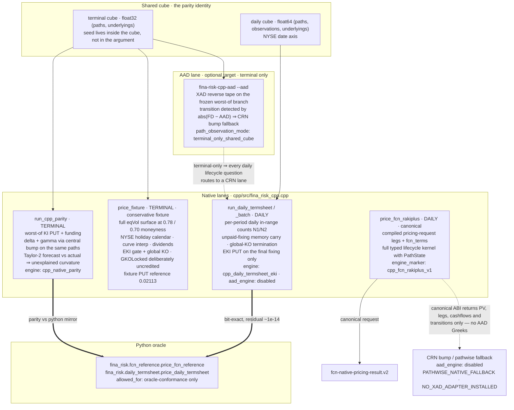

Capability matrix behind the diagram — the second axis of lane choice is granularity,
not just speed:

| Lane | Granularity | KI | Memory coupon | Memory KO | Local KO | Greeks | Typical use |
|---|---|---|---|---|---|---|---|
| `run_cpp_parity` | terminal | EKI (mask) | no | no | no | delta, gamma, Taylor-2 | throughput benchmark, P&L explain at scale |
| `price_fixture` | terminal | EKI | no | no | no | bump | reconciliation vs the legacy reference |
| `run_daily_termsheet` | daily | EKI | yes (N1/N2) | no | no | central bump delta/gamma | termsheet parity, lifecycle evidence |
| `price_fcn_rakiplus` | daily | EKI | yes (N1/N2) | `per_underlying_ever` | declared but unreachable | — | production RFQ quoting |
| `fina-risk-cpp-aad` | terminal | EKI | no | no | no | XAD delta, CRN fallback | AAD feasibility study only |

**The load-bearing fact for a model diagram: AAD and the daily lifecycle are currently
different lanes.** The AAD app prices a terminal cube only
(`aad_benchmark.cpp:77`, `path_observation_mode: terminal_only_shared_cube`), and the
`fina-risk` skill states it outright — *"The current shared benchmark path cube is
terminal-only … Daily EKI/range-memory parity requires a path-by-observation-date cube
and lifecycle-state evolution before it can be enabled."* Any model diagram that draws an
AAD tape inside the daily lifecycle is wrong today.

## 1.4 Method selection per risk cell

The model layer also owns the rule that decides, per risk cell, whether AAD is
defensible. This is the single most important thing to visualise honestly, because the
system's failure mode is *over-claiming AAD*.

The rule lives in `modules/fina-risk/src/fina_risk/hybrid.py:12-36`; the transition band
is `hybrid.py:39-43`.

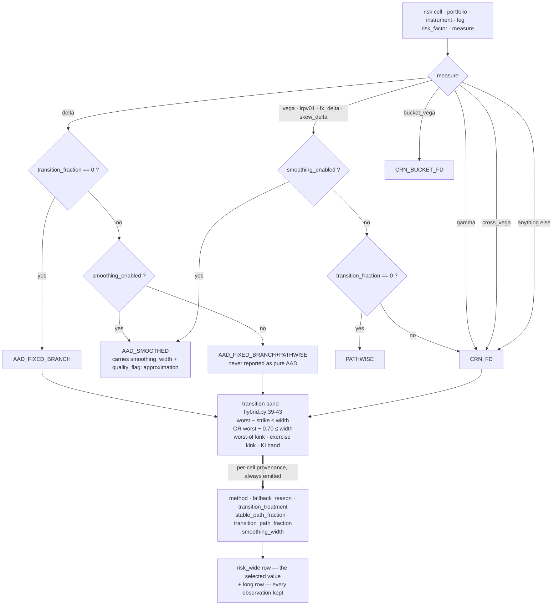

Three rules a model-layer diagram must not violate:

1. **A hard transition is never pure AAD.** `hybrid.py:104-108` will only emit
   `AAD_FIXED_BRANCH` when the transition set is empty.
2. **The KI barrier `0.70` is hard-coded into the transition mask** (`hybrid.py:43`).
   That is a model-layer constant; a trade with `KIBarrier = 0.65` is banded against
   `0.70`. This is a live correctness issue, not a styling issue, and it belongs in the
   model diagram as a *visible* constant.
3. **Gamma is never AAD today.** `hybrid.py:30-31` routes gamma to `PATHWISE`/`CRN_FD`
   because second-order tape support is absent, and
   `refs/aad-barrier-capability-assessment.md:88` says so explicitly.

## 1.5 The evidence gate is a model-layer state machine

`compile_canonical_terms` (`engine.cpp:76-189`) is the model's own admission check. It
runs *before* any path is priced and can veto the whole product; the cube-shape check in
`price` (`engine.cpp:192-193`) and the missing-fixing check (`engine.cpp:233`) complete
the gate. Its four outcomes come from `EvidenceStatus` (`types.hpp:13`, wire strings at
`types.hpp:38-46`).

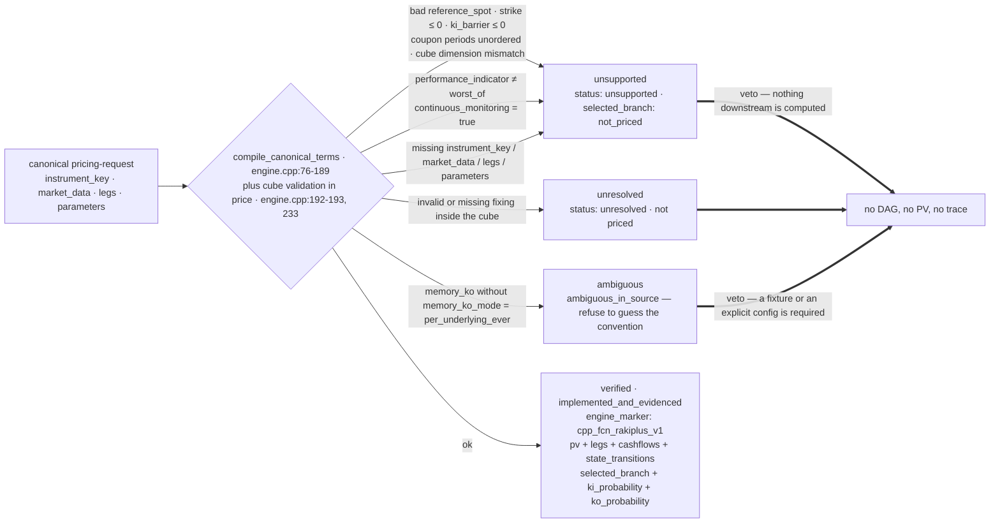

This is the concrete implementation of the SKILL.md anti-pattern *"Filling undocumented
behavior with a convenient default → silent wrong PV"*. `ambiguous` is a **distinct
state from `unsupported`**, and a visualisation that collapses them to a red error loses
the distinction between "we cannot do this" and "the source does not say".

## 1.6 The model's own output: a population, not a trade

`engine.cpp:352-353` reduces a whole pricing run to one `selected_branch` label plus two
probabilities. This is a *model-population* lens: "given this calibration and this
method, what is the typical outcome shape?" The trade layer answers a different question
about one deal. Conflating them is how dashboards end up showing a portfolio statistic
next to a single trade.

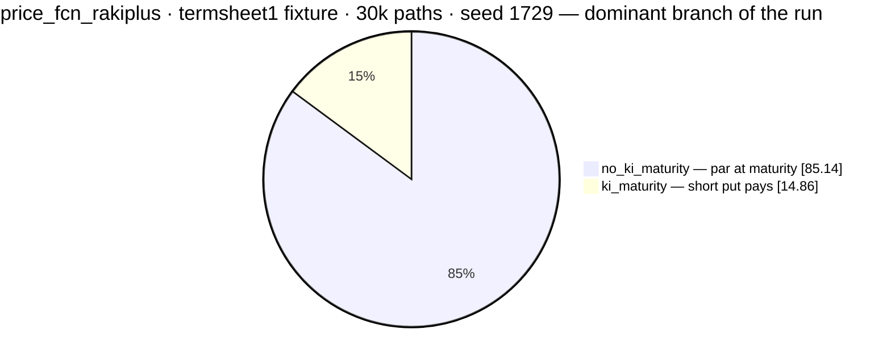

`selected_branch` has exactly six values, chosen by dominance, not by majority:
`no_ki_maturity` · `ki_maturity` · `mixed_ki_maturity` · `local_ko` · `global_ko` ·
`mixed_ko` (`engine.cpp:352-353`), and `not_priced` when the gate vetoes
(`engine.cpp:70`). The reported probabilities are `ki_paths / paths` and
`ko_paths / paths` over the *same* run, so they are mutually consistent by construction.

**Recommended model-layer lens:** show `selected_branch` + `ki_probability` +
`ko_probability` as a population strip over the family, and never label it as anything
belonging to one trade.

---

# Part 2 — Trade layer

## 2.1 The trade is a binding, and the binding is a graph

The template layer already draws the payoff DAG. The trade layer needs a different
diagram: not *what the computation does*, but **which trade field configures which block**.
This is the constructor view, and it is the only place where "this is trade data, not a
model or template change" can be proven field by field.

Field names are from `compile_payoff_graph` and `lower_payoff_graph_to_fcn_terms`
(`payoff.py:500-569`) into `FcnTerms` (`terms.hpp:79-105`).

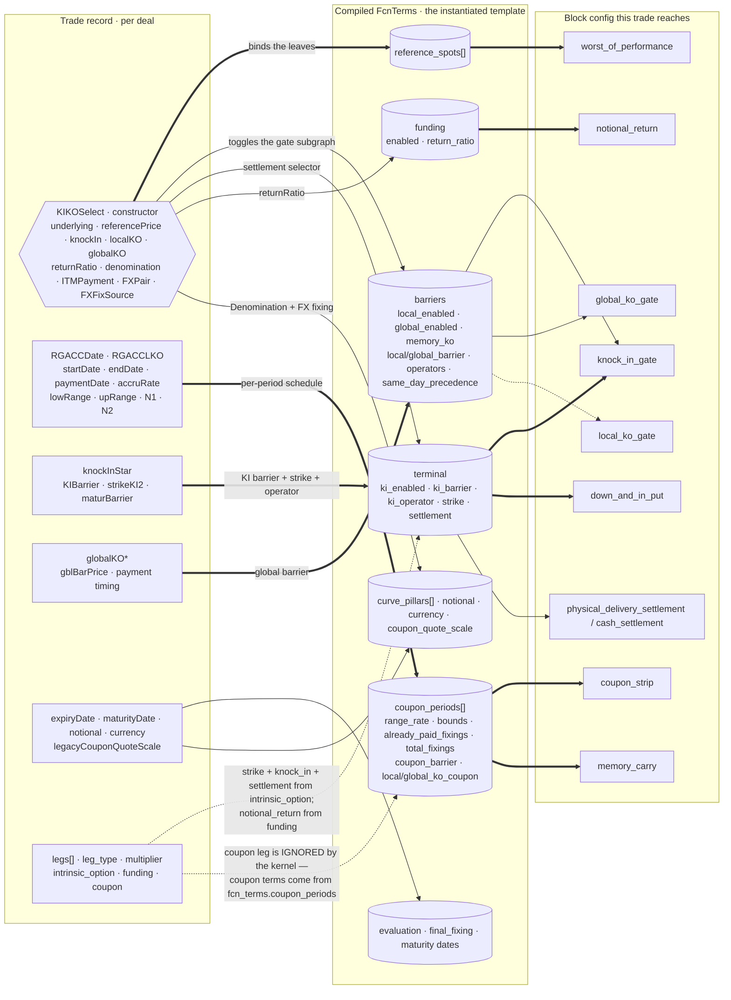

**This is the diagram that enforces the layer rule.** Everything on the left is trade
data. The moment a reviewer wants to add a field to this picture, the question to ask is
"which block's `config` does it land in?" If the answer is *none of them*, the change is
a template change; if it changes calibration or the lane, it is a model change.

## 2.2 Fields that go nowhere — draw the dead ends

A constructor diagram that only shows live wiring teaches the wrong lesson. The gaps
below are all verifiable in the current code, and all of them are places where a
drag-and-drop editor would silently produce a plausible-looking wrong product.

| Trade field / intent | Landing place | Status | Evidence |
|---|---|---|---|
| `GKOLocked[]` / `GKODate` memory-call seed | — | **not consumed.** `FcnTerms` has no `locked` field; `PathState` is zeroed at the start of every path | `terms.hpp:79-105`, `engine.cpp:216-225` |
| `alreadyKnockIn` per leg | — | **not consumed** by the canonical kernel | as above |
| `localKO` / `locBarPrice` | `barriers.local_enabled / local_barrier` | **unreachable.** `compile_payoff_graph` never emits a `local_ko_gate` node, and `local_enabled` is derived from that node's presence, so it is always `false` | `payoff.py:86`, `payoff.py:542` |
| `same_day_ko_precedence` | `barriers.same_day_precedence` | **hard-coded `"global"`** at lowering time | `payoff.py:549` |
| `legs[].multiplier` (any leg) | — | **dropped.** PV sign is kernel-owned: `pv = funding + coupon − put` | `engine.cpp:344-349` |
| `ITMPayment` | `terminal.settlement` + `physical_delivery` | live, but the graph **always** emits `physical_delivery_settlement` and never `cash_settlement`; the distinction lives only in a node's `enabled` flag | `payoff.py:327-336` |
| `range_accrual` | folded into `coupon_strip` | no separate node; `in_range` is reached through the coupon strip config | `payoff.py:286-298` |
| `aggregate_legs` | — | not a palette block; aggregation is `engine.cpp:349` | SKILL.md DAG shows it in the OUTPUT subgraph but it is absent from the 13-block catalog |

`GraphNode` and `FUNCTION_BINDINGS` do list `local_ko_gate`
(`payoff.py:85-86`), so the palette advertises a block the emitter can never produce.
A visualiser that renders the palette as "available blocks" without an
emitted/blocked distinction will ship a dead block.

## 2.3 The per-path lifecycle is a state machine

`price()` (`engine.cpp:216-355`) runs one `PathState` per path. This is the animation
dataset, and it is genuinely a state machine, so it is drawn as one.

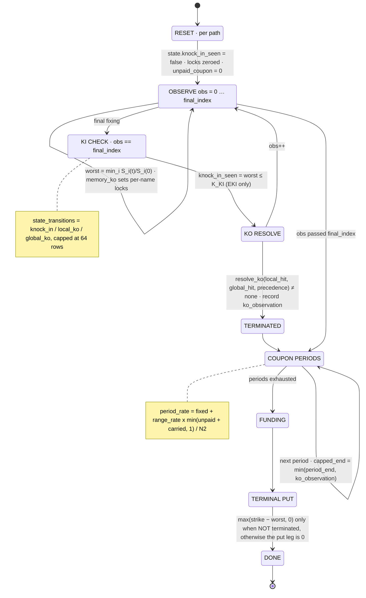

The coupon arithmetic the `COUPON PERIODS` state stands for, from
`coupon.hpp:15-25`: `unpaid = max(qualifying − N1, 0)`,
`period_rate = fixed_coupon + range_rate × min((unpaid + carried) / N2, 1)`,
`next_memory = max(N2 − unpaid, 0)`. The settlement date is the KO date on the KO
period and `payment_date` otherwise (`engine.cpp:296`).

`state_transitions` is the emitted trace, and it is **capped at 64 exemplars** by
`add_transition` (`engine.cpp:57-63`) so that a 30k-path run does not ship a 30k-row
array. A visualiser must label the replay as exemplars.

The state carried between observations is small and closed
(`state.hpp:9-19`): `terminated`, `knock_in_seen`, `local_ko_seen`,
`global_ko_seen`, `selected_ko`, `ko_observation`, `local_memory_locks[]`,
`global_memory_locks[]`, `unpaid_coupon`. That is the whole lifecycle memory of a
trade path — nine fields, which is why a state diagram fits and a node-per-block diagram
does not.

Two visual consequences:

- **Memory is a period edge, not a cycle.** `memory_carry` feeds forward into the next
  period, so the graph is unrolled in time. A diagram that draws a cycle will not
  correspond to a DAG and cannot be traced.
- **KO is a `break`, not a branch.** Once `state.terminated` is set the path skips the
  remaining observations, caps the last coupon period at `ko_observation`, pays funding
  at the KO date, and never evaluates the terminal put (`engine.cpp:310-315`).

## 2.4 The trade's result: dated cash flows and a state trace

`assemble_json` (`result_assembly.cpp:10-37`) is what a trade UI should draw. Three
collections, three different shapes.

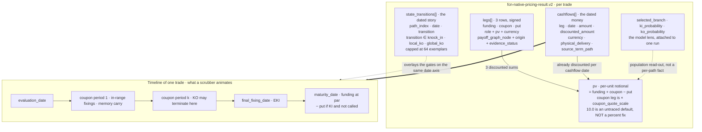

`source_term_path` is the trace provenance, and it is a **term-space** pointer:
`/fcn_terms/coupon_periods/0`, `/fcn_terms/terminal`, `/fcn_terms/funding`,
`/fcn_terms/terminal/knock_in`, `/fcn_terms/barriers` (`engine.cpp:246,257,326,336,342`).

## 2.5 The round trip is currently broken

The obvious design is: trade result leg → template graph node → highlight. The kernel
carries a `payoff_graph_node` field for exactly this (`leg_result.hpp:16`), but the
values do not match the node ids the emitter produces.

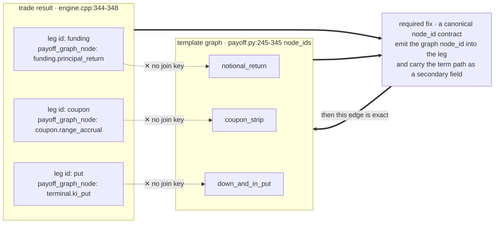

Three vocabularies are in play for the same three legs, and a visualiser has to pick
one and translate:

| Stage | Vocabulary | Source |
|---|---|---|
| graph leg `role` | `ki_put` · `funding` · `coupon` | `payoff.py:362` |
| request `leg_type` | `intrinsic_option` · `funding` · `coupon` | `payoff.py:606` |
| result `legs[].role` | `funding` · `coupon` · `terminal_optionality` | `engine.cpp:344-348` |

The `payoff_graph_node` strings look like they were written against a
`fina/payoff-graph/v1` *path* convention (`funding.principal_return`) rather than against
the node ids that same schema version emits (`notional_return`). Until a canonical id
contract exists, the trade→template highlight in a builder must be driven by
`leg.role`, not by `payoff_graph_node`.

## 2.6 The trade as a versioned record

The trade layer is not just a terms record. `modules/fina-trade` makes it a versioned
lifecycle aggregate, and that is what a trade-level visualisation is really about.

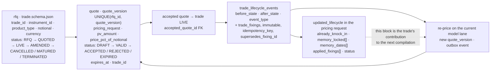

The loop closes on the model layer: the same `model_id` and lane price every version,
and only the `updated_lifecycle` block and the bound terms change. That is the layer
separation in operational form.

**However — the `updated_lifecycle` block is not yet consumed by the canonical kernel.**
The schema path exists (`pricing-request.schema.json` `lifecycle-state`,
`fcn-lifecycle-state.schema.json`) and the C++ `PathState` has the fields to receive it,
but `price()` re-seeds every path from zero (`engine.cpp:216-225`). A trade-lifecycle
diagram that shows memory state flowing into the pricing kernel is, today, drawing an
intent rather than a code path. Mark the arrow as such until the seed is wired.

---

# Part 3 — Cross-layer

## 3.1 Three seals

Each layer produces a value that cannot be produced by another layer. Together they make
an auditable claim: *this number came from this model, assembled from this template,
for this trade.*

| Layer | Seal | Value | Produced by |
|---|---|---|---|
| Model | engine identity | `engine_marker` (`cpp_fcn_rakiplus_v1`, `cpp_daily_termsheet_eki`, `cpp_native_parity`), `aad_engine`, per-cell `method` + `fallback_reason` | `leg_result.hpp:23-28`, `result_assembly.cpp:28-36`, `hybrid.py:109-118` |
| Template | structure identity | `graph_hash` over the canonical graph document, plus `function_bindings` | `payoff.py:71-74, 449` |
| Trade | instance identity | `request_id` · `process_id` · `source_revision`, carried in both directions | `terms.hpp:81-86`, `engine.cpp:367-371` |

## 3.2 What earns a new layer

This is the rule the SKILL.md states in prose. Stated as a decision, it is the thing a
visual builder must apply to every edit:

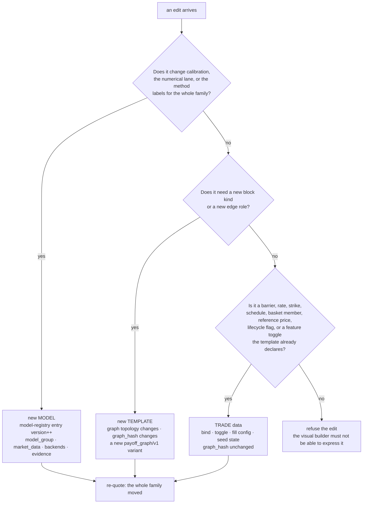

The last branch matters as much as the others. A closed palette means the editor has to
be able to *say no*; a visualiser that can render any node an operator types is not a
payoff-graph tool, it is a drawing tool.

## 3.3 Anti-patterns specific to the model and trade layers

Additions to the SKILL.md guardrail table. Each is grounded in a line of code.

| Anti-pattern | Symptom | Why it breaks | Fix |
|---|---|---|---|
| Changing the vol read, calendar, or correlation source "for this deal" | One quote disagrees with the family | Calibration is shared; a per-trade override silently breaks comparability and parity | Model change: bump the registry entry; re-price the family |
| Drawing an AAD tape inside the daily lifecycle | Diagram shows Greeks the lane never computed | AAD is terminal-only today; the daily lane reports `aad_engine: disabled` | Draw the lane as it is: AAD on the terminal cube, CRN on the daily cube |
| Reporting a hard transition as AAD | Greeks look fast and are wrong off-branch | The tape differentiates the selected branch only; the probability mass across the digital is missed | `AAD_FIXED_BRANCH+PATHWISE`, keep `transition_path_fraction` visible |
| Banding transitions against a hard-coded `0.70` KI level | Trades with a different `KIBarrier` are mis-banded | The band constant is in the model layer (`hybrid.py:43`) while the barrier is trade data | Make the band a model parameter fed by the trade's KI barrier |
| Rendering `local_ko_gate` as an available block | Editor offers a block the emitter never produces | The palette lists it; `compile_payoff_graph` never emits it, so `local_enabled` is always false | Mark palette entries as `emitted` / `declared` / `implemented` |
| Animating `state_transitions` as the full population | The replay looks exhaustive and is a 64-row sample | The cap is an explicit memory guard (`engine.cpp:57-63`) | Label the trace as exemplars; carry `ki_probability` / `ko_probability` beside it |
| Re-seeding the parity lane to "fix" a mismatch | Two lanes appear to disagree for no reason | `run_cpp_parity` ignores its `seed` argument: the cube *is* the identity (`fina_risk_cpp.cpp:769`) | Pin the cube, not the seed; the parity gate is cube identity |
| Showing `payoff_graph_node` as a graph join key | Leg highlight lands on nothing | The strings do not match emitted node ids (§2.5) | Join on `leg.role` until a canonical id contract lands |
| Trusting a leg `multiplier` from the trade | A long put prices as a short put | The kernel owns the sign: `pv = funding + coupon − put` | Model the sign as kernel-owned, or make the kernel read `multiplier` |
| Dropping the `coupon_quote_scale` label | "PV 1.2279" is read as 122.79% or as a currency amount | Legs are per-unit notional and the coupon leg is quote-scaled | Always render the unit with the number |

## 3.4 Proposed wiring into SKILL.md

If this study is accepted, three anchors in the SKILL.md would carry it without growing
the main body:

1. After the "Three layers: model / template / trade" table, add a link to
   [ModelAndTradeLayer](ModelAndTradeLayer.md) §1.2 and §1.3 — "what a model is, and
   which lane priced this".
2. In the block catalog section, add the "emitted / declared" distinction from §2.2.
3. Under "Where the payoff script sits", add the result round trip from §2.4 and the
   vocabulary note from §2.5.

## 3.5 Open questions

1. **Canonical node id contract.** Should `payoff_graph_node` become the emitted
   `node_id`, or should the graph emit dotted paths? The answer decides whether a builder
   can highlight legs on the DAG at all.
2. **Lifecycle seed.** The schemas and `PathState` are ready; the kernel re-seeds per
   path. Is the seed a `FcnTerms` field, a per-path input, or a pre-simulated state cube?
3. **Transition band constant.** `0.70` in `hybrid.py:43` should be derived from the
   trade's `KIBarrier`. Doing so moves a number from the template layer to the model layer
   — worth recording as a model change.
4. **`local_ko_gate`.** Either emit the node and honour `localKO`, or retire it from the
   palette. Today it is a block that is declared, bound, and unreachable.
5. **`aggregate_legs`.** It appears in the DAG's OUTPUT subgraph but not in the 13-block
   catalog. Suggest naming it explicitly as kernel-owned, non-swappable, so a reader does
   not look for a binding for it.
