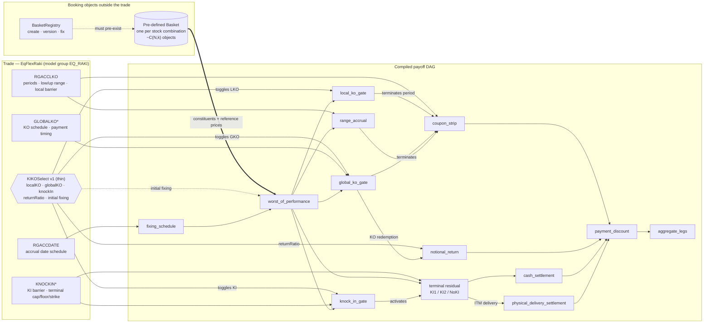

# RAKI (v1) — `EqFlexRaki`

RAKI is the base equity range-accrual note (model group `EQ_RAKI`). The payoff blocks below are the same vocabulary used by the visual builder; the important structural fact of v1 is that the **worst-of basket is a pre-defined market object that lives outside the trade**, while `KIKOSelect` is thin — it only activates features and carries `returnRatio` / initial fixings. This is the source of the combinatorial basket maintenance described in the [history section](../SKILL.md#history-raki--rakiplus--visual-blocks).

## Target DAG with KIKOSelect

## What to notice

- The **thick arrow** `BASKET ==> WOP` is the coupling that hurts: the compiled DAG cannot be built until an external, pre-defined basket object exists.
- `KIKOSelect v1` only has **thin dashed/activation edges** into the gate and `notional_return` blocks. It is a feature switch, not a leaf binder.
- There is no `memory_carry` and no cash-flow rounding node; those arrive with MemRaki / RakiPlus.
- The residual is a RAKI terminal family (`KI1` / `KI2` / `NoKI`), not the FCN `down_and_in_put`.

Compare with [RakiPlus](RakiPlus.md); the node vocabulary is deliberately identical so the diff is the construction pattern.
