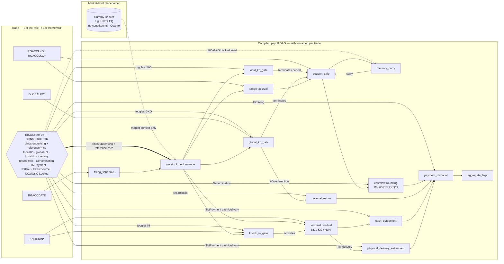

# RakiPlus / MemRakiPlus (v2) — `EqFlexRakiP` / `EqFlexMemRP`

RakiPlus keeps the RAKI pricing foundations but changes the **booking construction**: a market-level **dummy basket** placeholder replaces the per-combination basket object, and the trade's real constituents and reference prices move **into `KIKOSelect`**. `KIKOSelect` therefore becomes the per-trade **constructor** that instantiates the DAG (binds leaves, toggles subgraphs, selects settlement, adds rounding/FX fields, seeds memory locks). See the [history section](../SKILL.md#history-raki--rakiplus--visual-blocks) for the comparison table.

## Target DAG with KIKOSelect

## What to notice

- The **thick arrow** now runs `KIKOSelect ==> worst_of_performance`: the trade constructor supplies the basket leaves, so the DAG is self-contained and no external per-combination basket is required.
- The dummy basket is a **dashed, cheap placeholder** (market context only) instead of a thick external dependency.
- `KIKOSelect v2` gained an **`ITMPayment` settlement selector** (choosing `cash_settlement` vs `physical_delivery_settlement`), a **`Denomination` rounding node**, **FX-fixing** input, and an **`LKO/GKO Locked` seed** into `memory_carry`.
- `memory_carry` and the rounding node are present because RakiPlus covers the MemRakiPlus variant; both are absent in [Raki](Raki.md).

Diff this diagram against [Raki](Raki.md): the core payoff nodes are identical, the change is entirely in **who constructs the graph**.
