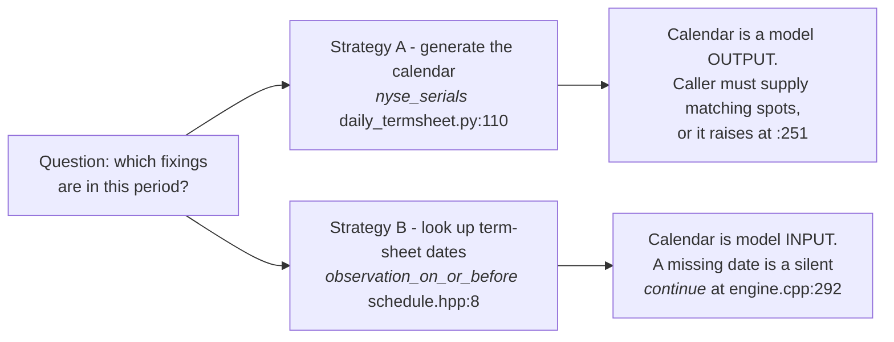

# Where each block actually lives, lane by lane

This page exists because the **Kernel** column in [README.md](README.md) is a lie
by omission. It answers "does a standalone function implement this block?" — one
cell, one answer — and the code does not work that way. A block either has a
kernel, or it is **inlined in every lane separately**, and each of those copies
was written by a different person for a different purpose and none of them
reconciles with the others.

So for four catalogue blocks the honest answer is a *matrix*, not a cell. This page
is that matrix. It is also the concrete evidence behind
[02-why-there-are-lanes.md](02-why-there-are-lanes.md).

**Two corrections first, and the second withdraws the first.**

An earlier version of this page reported that `fina_risk_cpp.cpp` has "no call
logic at all". That was **wrong** — `:458` reads the call barrier and `:524-535`
implements a fifth distinct formulation of the call. The correction mattered, and it
was then used to say something further: that this lane carries a **written, deliberate
departure from the term sheet** where every other lane carries an accidental one,
and that the departure should be preserved and labelled rather than fixed.

**Both halves of that are withdrawn.** The platform's own documentation forbids the
reading in specific words, and the comment's stated reason for it — that it is
*conservative* — is inverted: missing a call leaves the note alive and the coupon leg
running, which is more liability, not less. The full argument is in
[02-why-there-are-lanes.md](02-why-there-are-lanes.md#what-a-dynamically-constructed-dag-would-actually-fix);
the short version is below, because the block is here.

---

## The lanes, named

| # | lane | entry | reads | writes |
|---|---|---|---|---|
| 1 | canonical C++ | `engine.cpp` | `fcn_terms` (struct) | `Result` |
| 2 | scalar C++ | `fina_risk_cpp.cpp` | raw legacy JSON | `BenchmarkResult` |
| 3 | legacy numpy | `pricing.py` | raw legacy JSON | dict |
| 4 | independent oracle | `fcn_reference.py` | `fcn_terms` (dict) | dict |
| 5 | daily termsheet | `daily_termsheet.py` | raw legacy JSON + a spot cube | `DailyTermsheetResult` |
| 6 | hybrid / AAD | `hybrid.py`, `aad.py` | raw legacy JSON | pathwise arrays |

Lanes 1 and 4 are the pair that *should* be checked against each other — same
input type, one fast and one readable. Lane 1 is the production path. Lanes 2, 3,
5, 6 all read the **legacy JSON directly** and never touch the graph at all, so
nothing in the graph's structure constrains them.

---

## `global_ko_gate` and `local_ko_gate`

**The declared kernel is not the block.** `payoff.py:88-93` binds *both* node kinds
to the same symbol:

```python
# payoff.py:92-93, abridged
{"node_kind": "global_ko_gate", "module": CPP_MODULE, "symbol": "fina::risk::fcn::resolve_ko", ...
{"node_kind": "local_ko_gate",  "module": CPP_MODULE, "symbol": "fina::risk::fcn::resolve_ko", ...
```

and `resolve_ko` is six lines (`barriers.hpp:17-22`):

```cpp
// barriers.hpp:17-22
inline KnockOutKind resolve_ko(bool local_hit, bool global_hit, KnockOutKind precedence) noexcept {
    if (local_hit && global_hit) return precedence;
    if (global_hit) return KnockOutKind::global;
    if (local_hit)  return KnockOutKind::local;
    return KnockOutKind::none;
}
```

That answers *"given that two things fired, which one counts?"* It does not answer
*"did a barrier fire?"* — which is the block. The block is inlined, in every lane,
five different ways.

| lane | site | formulation | is the call used? |
|---|---|---|---|
| 1 `engine.cpp` | `:243-244,255-260` latch, `:267-268` test, `:269` `resolve_ko` | sticky per-asset latch if `memory_ko`, else joint `worst ≥ b` | yes — but `global_enabled` is `false` on the shipped fixture |
| 2 `fina_risk_cpp.cpp` | `:464-493` + `:560-572` **fixed**; `:884-895` and `:1084-1090` **still open** | one site is now a sticky per-asset latch seeded from `GKOLocked`; the other two are a joint test, all assets ≥ 110% **on the same fixing** | **only on the put.** The coupon loop at `:593-598` never reads `called` |
| 3 `pricing.py` | `:304-321` | sticky per-asset latch with a path-level copy | **no** — computed, then discarded by `np.where(x, y, y)`, stage-1 site now at `:358` |
| 4 `fcn_reference.py` | `:61` | reads `memory_ko`, defers to the caller | no |
| 5 `daily_termsheet.py` | `:260-262` | `np.all(performance ≥ b, axis=2)`, `np.any(...)` over days | **yes — the only lane where the call actually shortens the coupons** (`:300`) |
| 6 `hybrid.py` | — | none | no |

**Five formulations across six lanes, and after stage 1 the file that gained the
conformant one is the same file that still carries the non-conformant one twice.**
Lane 5 is still the only lane where the call actually shortens the coupons, and it
still has no latch at all. Lane 3 still implements the term sheet's rule and still
discards the result. Lane 2, which had the one non-conformant formulation, now has a
conformant one in `price_fixture` **and the old joint test, byte for byte unchanged,
in `run_cpp_parity` and in `price_daily_compact`.** One file, one set of deal
geometry, two different answers — and not one of the three reaches a PV.

That last part is the finding, and it is worse than the original bug. The original
bug was one site reading the contract wrongly. This is one file that has both
readings in it, so there is no longer any single place in the C++ lane to go and
look when the two disagree.

### The one departure that was not a departure, and is now deleted

For a while `price_fixture` carried the only comment in this codebase that wrote
down a reason to differ from the term sheet. It is worth quoting in full, and it is
worth saying in the same breath that **it is no longer in the tree.** Stage 1 deleted
it along with the code it was defending, which is why this block is a `text` fence
and not a `cpp` one — a reader who goes looking for it will not find it, and
that is the correct outcome:

```text
// DELETED at stage 1, along with the code it defended. Formerly the four
// comment lines that opened the global-KO block in price_fixture.
// Conservative global-KO read: the daily auto-call requires every
// underlying at/above the 110% call barrier on the SAME fixing;
// pre-locked memory state is intentionally not credited (that only
// makes the call easier and would lower the reserve).
```

It was recorded as *"a real, defensible, disclosed reserving decision — and it
should be preserved as such, not fixed"*. **It is a bug, and the comment is wrong in
both of its claims.**

What replaced it, in `price_fixture`:

```cpp
// fina_risk_cpp.cpp:560-572
std::vector<bool> latched = gko_locked;
for (int step = 0; step < steps; ++step) {
    const double z1 = normal(rng);
    const double z2 = correlation * z1 + orthogonal_scale * normal(rng);
    bool all_latched = true;
    for (std::size_t i = 0; i < quoted.size(); ++i) {
        const double z = i == 0 ? z1 : z2;
        log_spot[i] += (rate - dividends[i] - 0.5 * vols[i] * vols[i]) * dt
            + vols[i] * std::sqrt(dt) * z;
        if (std::exp(log_spot[i]) / refs[i] >= global_barrier) latched[i] = true;
        if (!latched[i]) all_latched = false;
    }
    if (all_latched) called = true;
}
```

`latched[i]` is set on the first fixing that clears the barrier and is never cleared
afterwards, and `gko_locked` is the flag the deal file was already carrying, read at
`:464-493`. One line changed meaning: `if (... < global_barrier) all_above = false`
became `if (... >= global_barrier) latched[i] = true`. The comparison is the same
one; what is new is that the answer survives the fixing it was computed on.

Not conservative: the comment argues that crediting a latch "only makes the call
easier and would lower the reserve". Missing the call does the opposite of lowering
the reserve — the note stays alive, the coupon leg keeps paying, and the terminal
branch is never reached. **The reading the comment calls conservative is the
expensive side**, and it is expensive in the product's headline feature.

Not a permitted departure: the term sheet says a Reference Asset **becomes** a
Memorised Reference Asset, and the note terminates when **each** has become one — a
status, not a same-day test. And the platform documentation is unambiguous, in three
separate files:

> Never overwrite a prior memory-hit or KI state with a later non-hit unless product
> semantics explicitly provide for reset, which the source does not.
> — `payoff/raki-plus.md:213`

> Update `ki_seen` monotonically. — `Products/KIKO/payoff/reverse-kiko.md:59`

> occurs **at least once for all underlyings** — `Memory_Range_Accrual_MemRaki.md:15-16`,
> and the same sentence appears in seven more files, including the glossary

The playbook even flags simultaneity as an open question at `raki-plus.md:224` and
then answers it, in the same document, at `:213`, in the direction above.

**Why it survived so long is the part worth keeping.** A comment that explains why
code differs from the specification is a *claim about the specification*, and it was
read for years as though it were a grant of permission. Nobody challenges a comment
that says the code is being prudent. And an earlier draft of this book did the
reading itself: it found a written reason to differ from the contract, and recorded
"documented departure" as settled. The mechanism that let a bug acquire the status of
a decision was a page of this very book.

There is still a distinction worth keeping, and it is not the one that was drawn. The
difference between the no-op `np.where` that was at `pricing.py:327` and the `lane 2`
comment quoted above is **accidental** versus **reasoned-and-wrong**, not accidental
versus *chosen*. Twenty correct lines multiplied by one, on the one side; a
considered reading that two higher sources overrule, on the other. Only one of them
has anything to recommend. `lane 2` has since been corrected, so the "reasoned"
side is now a historical record — but the distinction still holds for the two
sites at `:884-895` and `:1084-1090`, which are still reasoned-and-wrong, and for
every other multiplied-by-one line in this repository.

#### Lanes 2 and 3 now agree on the rule, and both still throw the answer away

`pricing.py:304-321` is the conformant implementation, and it is worth reading beside
the C++ now that the two say the same thing:

```python
# pricing.py:316-321
if newly_locked.any():
    # A path-level copy is needed because ADBE can be pre-locked while
    # AMZN remains open; the state is shared across all coupon periods.
    path_locked |= newly_locked
    is_called = path_locked.all(axis=1) & (call_date == steps)
    call_date[is_called] = step
```

Before stage 1, `price_fixture` required every underlying to be at or above the
barrier **on the day of the call** and read no latch at all. So on this deal — ADBE
latched on 2026-06-01, `GKODate[0] = 46174` — lane 3 terminated the note the moment
AMZN crossed 286.00, while lane 2 additionally required ADBE to be back **above
263.967** that same day. The two differed on every path after 2026-06-01.

That is closed for `price_fixture`. **It is not closed for the file.** Two sites in
`fina_risk_cpp.cpp` still run the joint test, unchanged:

```cpp
// fina_risk_cpp.cpp:884-894
for (std::size_t p = 0; p < P; ++p) {
    for (std::size_t o = 0; o < EO; ++o) {
        double worst = 1.0e30;
        bool all_above = true;
        for (std::size_t j = 0; j < U; ++j) {
            const double ratio = paths[(p * O + o) * U + j] / refs[j];
            worst = std::min(worst, ratio);
            if (ratio < gkb) all_above = false;
        }
        (void)worst;
        if (!ko[p] && all_above) { ko[p] = 1; ko_step[p] = o; }
```

That is `run_cpp_parity`, and the same seven lines stand in `price_daily_compact` at
`:1084-1090`. **`price_daily_compact` is the lane `termsheet1` is actually priced
through.** So the production lane for the only deal in this book is still
non-conformant, in a file that now also contains the conformant version.

**These two are recorded as open, not fixed, and the reason is the useful part.**
Neither is a local change. `price_daily_compact` is handed a *compact* instrument
record — `refs`, `strike`, `ki`, `call`, `expiry`, `notional`, `quote_scale` — and
that record has no field for the latch at all. The `gko_locked` key is not in the
schema, and the schema belongs to whoever writes the records: `generate_benchmark.py`
and the ETL. Threading it through is a record-schema change with a different owner
and a different risk profile, and adding only the read would be **worse than doing
nothing**, because it would be inert on every real deal while looking fixed in the
diff.

So the honest status is one site of three. What the fix did buy is the half that is
local and provable: the `price_fixture` rule, pinned by `lane/global_ko_latch` —
seven hand-derived cases, shown to fail three ways when the fix is reverted and two
ways when only half of it is reverted.

### A rule no lane implements: which KO wins on a shared day

"If both a Local and Global KO are triggered on the same day, the event is treated as
a Global KO" — `Memory_Range_Accrual_MemRaki.md:18`, `RAKI_Enhancement.md:48`,
`Products/KIKO/Reverse_KIKO.md:30`, and formally as `τ_G ≤ τ_L → GKO` at
`Products/KIKO/payoff/reverse-kiko.md:65`.

`payoff/raki-plus.md:30` claims the source does not say this. Three sibling documents
in the same playbook say it explicitly. **Inert on this deal** — `localKO: false`, so
there is no local call — which is exactly why it survives: a rule that cannot fire on
the only example anybody checked.

It is also the one place where `resolve_ko`, the misleading binding, is actually
right. The function's `precedence` parameter *is* this rule.

### And lane 2 prices a different product

Its coupon arithmetic at `:593-598`:

```cpp
// fina_risk_cpp.cpp:593-598
for (std::size_t i = 0; i < ends.size() && i < payments.size() && i < rates.size() && i < paid.size() && i < total.size(); ++i) {
    const int unpaid = std::max(total.at(i).get<int>() - paid.at(i).get<int>(), 0);
    const int fixings = std::max(total.at(i).get<int>(), 1);
    coupon += coupon_quote_scale * rates.at(i).get<double>() * static_cast<double>(unpaid) / fixings
        * std::exp(-rate * std::max(payments.at(i).get<int>() - evaluation_date, 0) / 365.0);
}
```

The scale is a named local read at `:591`, not the literal the first draft of this
book quoted. It was quoting an edit and calling it a quote.

has **no range test, no memory carry, no `min(…, 1)` cap, and no coupon barrier**, and
its scale is a local that defaults to `10.0` at `:591`. It is not `coupon_strip` implemented differently; it is
a fixed-schedule note. Compare the kernel's `period_rate` and note what is missing:
everything.

**The same two lines are also the accrual-factor defect, and it is shared with
lane 3.** `(N2 - N1) / N2` appears at `fina_risk_cpp.cpp:593-598` and
`pricing.py:333,342`. The documented factor is `N1 / N2`, in twelve platform files.
The expression here is neither the documented one nor its complement, because in this
payload **`N1` is days _elapsed_, not days in range** — it equals `fixingsDone` in
every one of the nine rows, and the payload contains no in-range count at all. So
the three already-elapsed periods book at **zero**, the five future periods at
**certainty**, and the 10% floor is never tested on a single simulated path. See
[blocks/coupon-strip.md](blocks/coupon-strip.md) and the `range_accrual` record in
[registry/blocks.yaml](registry/blocks.yaml) — this one is **blocked on data**, not
on a decision, which is why it is not on the stage-1 list.

### Two structural consequences for the graph

- **`local_ko_gate` was unreachable; stage 1 fixed the reachability, not the
  binding.** `local_enabled` is derived at `payoff.py:596` from
  `any(n["kind"] == "local_ko_gate" for n in nodes)`, and `compile_payoff_graph`
  never emitted that node — so `local_enabled` was permanently `false` for every deal
  in the system, including the ones that have a local call. The node is now emitted
  when the deal actually has one. This changes nothing for `termsheet1`, which has
  none, and everything for a deal that does.
- **Both node kinds still share one symbol**, so the graph cannot distinguish a local
  from a global gate even in principle, and neither can the traced lane. A traced run
  cannot tell a reader *why* the note terminated. The precedence parameter inside
  `resolve_ko` is the only place the same-day rule exists, and it exists there by
  accident rather than by declaration.
- **`99999`, `999.99`, and `900.0` are three different "no local call" sentinels.**
  The playbook uses `99999`; this payload's `upRange` is `999.99`; stage 1 introduced
  `_NO_LOCAL_BARRIER_SENTINEL = 900.0` because a sentinel must be distinguishable
  from a real level. Three numbers, none reconciled. The stage-1 choice is the only
  one of the three that is *safe*, and that is not a reason to call it correct.

---

## `worst_of_performance` — nineteen inline sites, six lanes

The README says "inlined twice". That counts `engine.cpp` only and is the kindest
possible reading. The real count:

| lane | sites | notes |
|---|---|---|
| 1 `engine.cpp` | `:235`, `:283` | the two copies **differ** — see below |
| 2 `fina_risk_cpp.cpp` | `:627`, `:716`, `:937`, `:945`, `:985`, `:1127`, `:1170` | 7 copies |
| 2 `fina_risk_cpp.cpp` | `:823-824` | `up_worst` / `down_worst` — a *different quantity* (barrier-scaled) |
| 3 `pricing.py` | `:250`, `:404`, `:411` | `:411` also takes `argmin` for the worst asset's **identity** |
| 4 `fcn_reference.py` | `:57`, `:89` | |
| 5 `daily_termsheet.py` | `:253` | |
| 6 `hybrid.py` | `:41`, `:70` | `:70-71` also takes `argmin` |

**The two `engine.cpp` copies are not equivalent, and that is the real finding.**
`:235` sits in the KO loop and also sets the memory latches; `:283` sits in the
coupon loop and does not. Same expression, different side effects, written twice in
one function, 48 lines apart. Any change to the performance definition has to be
made twice and the two will drift.

### The block is two blocks

`min()` gives you the worst **value**. `argmin()` gives you which **asset** it was.
`hybrid.py:71` (`performance.argmin(axis=1)`) needs the identity, to pick the strike
and to allocate the loss; `pricing.py:450` reconstructs it as a boolean mask instead,
which is a different quantity wearing the same clothes. The catalogue has one node
kind, `worst_of_performance`, and one output port, so the identity has nowhere to
live. `fina_risk_cpp.cpp:776-777` has already grown a third variant on its own, and
it is not even a worst-of: it is a barrier-scaled up/down pair.

### Lane 5 cannot price a basket

`daily_termsheet.py:258-259`:

```python
# daily_termsheet.py:258-259
refs = np.asarray([float(x["spot"]) for x in deal["instrument"]["underlyings"][:2]])
performance = observations[:, :, :2] / refs[None, None, :]
```

The basket is **hardcoded to two assets**. The guard at `:241` accepts
`shape[2] >= 2`, so a three-asset deal passes validation and is silently priced on
the first two. `engine.cpp:250` loops over `cube.underlyings` and would handle any
count. This is a two-line fix and a live wrong-answer.

**Two is our limit, not the product's, and that is a different kind of finding.** An
earlier version of this book called the lane "two-name by construction", which reads
as a product limitation. The platform states its own: *"Basket Size: maximum of 6
underlying stocks"* (`RakiPlus_MemRakiPlus.md:121`, `payoff/raki-plus.md:217`), and
"Single Equity: not supported" makes two the **minimum**, not the ceiling. The
platform data shape already carries an array of underlyings with per-underlying
reference prices. So the stage-1 refusal to truncate is right, and the cap is an
implementation gap of at most two lines.

### Three things the term sheet settles about this block

The playbook deliberately leaves the aggregation undefined — *"The source labels the
accrual indicator as either Worst Performance or All Underlying, but does not define
a mathematical aggregation convention for either"* (`payoff/raki-plus.md:34`). It is
undefined **in the platform**. The contract is not:

> the Reference Asset which generates the lowest percentage … (Closing Price of the
> relevant Reference Asset on the relevant Scheduled Trading Day) / (Initial Spot
> Price of the relevant Reference Asset) × 100%, rounded to four decimal places, with
> 0.00005 or above rounded upwards
> — `termsheet1.md:275-276`

So the indicator is `min_i(close_i / initial_i)`, the 4dp rule is a contract term, and
the tie-break is *"in our sole and absolute discretion"* — **explicitly not
modellable**. Record that last one as a known-unimplementable term rather than a
missing feature, because it is a different thing and only one of them is a defect.

Two more rules, both currently satisfied by accident:

- **A latched asset stays in the basket.** *"If a Reference Asset becomes a Memorised
  Reference Asset, such Reference Asset remains as part of the Reference Basket for
  the purposes of determining whether a Knock-in Event has occurred and for the
  purposes of determining the Final Settlement Payout"* (`termsheet1.md:279`). Dropping
  called assets is a tempting optimisation and it would break the contract. No lane
  does it, and the `worst_of_performance → knock_in_gate` edge is therefore correct —
  for a reason nobody wrote down.
- **`MaturBarrier ≥ KIBarrier` is load-bearing.** The KI payoff branches on
  `WPS ≥ MaturBarrier` (`payoff/raki-plus.md:139-140`). This deal sets
  `MaturBarrier = 0.78` and `KIBarrier = 0.7`, so a knocked-in deal has
  `WPS ≤ 0.70 < 0.78` and **the KI1 branch is unreachable** — which is the only reason
  it is safe that `strikeKI1 = 0`. A booking that ever set `MaturBarrier` below the KI
  barrier would reach `PR_KI1 × (WPS / Strike_KI1 − 1)` with a zero denominator.
  **Assert the invariant; do not rely on it.**

---

## `payment_discount` — the lanes do not agree on the discount *rate*

First, the thing that is **not** wrong: every lane uses ACT/365. `year_fraction` is
`/365.0` (`pricing.py:34`) and the C++ is `/365.0`. Ruled out.

The lanes differ on **where the rate comes from**:

| lane | sites | rate used |
|---|---|---|
| 1 `engine.cpp` | `:298`, `:309`, `:314` | `curve_rate_at(curve_pillars, rate, settlement_date)` — **interpolated at the settlement date** |
| 2 `fina_risk_cpp.cpp` | `:644`, `:993`, `:1177` | a single flat `rate` |
| 3 `pricing.py` | `:328`, `:408` | flat `market.rate` |
| 4 `fcn_reference.py` | `:106`, `:112`, `:115` | flat `rate` |
| 5 `daily_termsheet.py` | `:269`, `:304` | `curve[0]["rate"]` — the **first pillar**, for every date |

So lane 1 honours the curve and lanes 2–5 use the short end for a six-month
discount. On a flat curve they agree. On a sloping one they do not, and **they
diverge by construction** — `curve_rate_at` is linear-in-rate interpolation with
flat extrapolation (`terms.hpp:12-32`), added by commit `aae72d1`, and it was
never propagated to the other five lanes.

### The worse half: the curve is empty by default

`payoff.py:618` writes the fallback `market_data` for a pricing request. Abridged, so
that the shape is visible and the `"curves": []` is not lost in the noise:

```text
"market_data": graph.get("market_data") or {
    "evaluation_date": ...,
    "curves": [],
    ...
}
```

`engine.cpp:97` guards the **entire** curve read behind a non-empty check:

```cpp
// engine.cpp:97
if (market.contains("curves") && market.at("curves").is_array() && !market.at("curves").empty()) {
```

With `"curves": []` the block is skipped, `terms.rate` keeps its struct default, and
`terms.hpp:89` declares `double rate{};` — **zero**. The note is then discounted at
**0%** and returns a plausible PV. `server.py:708` validates that `market_data` is
*present*; it does not validate that `curves` is *populated*.

**And the oracle cannot catch it.** `fcn_reference.py:36` is
`rate = market.get("curves", [{}])[0].get("pillars", [{}])[0].get("rate", 0.0)` — it
also defaults to `0.0`. Lanes 1 and 4 agree, for the wrong reason, and a parity
test between them is green on a note with no discount rate.

This is the single best argument in this book for `payment_discount` being a block
rather than an inlined expression: **a block has a place to put the refusal.**
"Refuse to price without a curve" is not expressible at `engine.cpp:97`, where the
only available options are *interpolate* and *silently use zero*.

### Two names, one expression

`daily_termsheet.py:273-275` and `:310-312` are verbatim copies of

```python
# daily_termsheet.py:273-275 and :310-312
market.get("discCurves", [{}])[0].get("curve", [{"rate": 0.0}])[0].get("rate", 0.0)
```

bound to `disc_rate` and `payment_disc_rate`. The two names imply the put leg and the
coupon leg are discounted at different rates. They are not, they cannot be, and a
reader will assume they are.

---

## The other axis you asked about: daily observation vs `fcn_terms`

This is a second, independent lane split, and it cuts across all six lanes above.
There are **two different strategies for answering "which fixings belong to this
period"**, and they fail in opposite ways.



| | Strategy A — generate | Strategy B — look up |
|---|---|---|
| where | `daily_termsheet.py:110-127` | `schedule.hpp:8-9`, used at `engine.cpp:290-291` |
| calendar source | `us_market_holidays` at `daily_termsheet.py:85-107`, hand-rolled | whatever the cube supplies; term-sheet `start_date`/`end_date`/`payment_date` |
| mismatch behaviour | **raises** (`:251-252`) | **silent `continue`** (`:292`) |
| who owns the calendar | the code | the term sheet |

Strategy A fails loudly, which is the better default. Strategy B fails silently:
`if (begin > end || begin >= cube.observations) continue;` at `engine.cpp:292`
drops a coupon period with no error, no `EvidenceStatus`, and no counter. A period
whose dates sit outside the supplied cube simply does not exist.

**The two strategies also disagree about what a trading day is**, which is the next
finding.

---

## Two hand-rolled NYSE calendars — and a bug they share

`daily_termsheet.py:85-107` and the C++ `is_us_market_holiday` are two independent
implementations of the same holiday list. The Python one's docstring says:

> `"""NYSE full-day closures. Mirrors ``is_us_market_holiday`` in the C++ lane."""`

**I originally wrote in this book that they disagree on Memorial Day in 9 of 11
years. That was wrong, and the test caught it.** The C++ helper is

```cpp
// nyse_calendar.hpp:73
inline int last_weekday_of_month(int year, int month, int target)
```

and `target` is a **weekday**, so `last_weekday_of_month(y, 5, 0)` is the last
*Monday* of May, which is Memorial Day. The name reads like "last working day"
and that is how I misread it. The two calendars agree on every holiday, in every
year I have checked. There was no divergence here at all.

What the new cross-language test found instead is worse, and quieter: **both copies
have the same bug, so a diff between them can never see it.**

> When 1 January falls on a Saturday, the exchange observes New Year's Day on the
> **preceding Friday** — 31 December of the *previous* year.

Both copies look the holiday up by the current date's own year, so for a 31
December they test `observed_weekday(prev_year, 1, 1)`, which is a different date
entirely. The day is never flagged, and the calendar trades it.

| year | 1 Jan is | exchange closed | flagged? |
|---|---|---|---|
| 2022 | Saturday | Fri 2021-12-31 | no |
| 2028 | Saturday | Fri 2027-12-31 | no |
| 2033 | Saturday | Fri 2032-12-31 | no |
| 2039 | Saturday | Fri 2038-12-31 | no |

Four wrong trading days in 26 years, each one a wrong fixing count and therefore a
wrong accrual. **This does not change `termsheet1`**, whose window closes
2027-02-01. It will bite the first deal valued across a New Year.

The lesson is the part worth keeping. A test that compares two copies proves they
agree; it cannot prove either is right. Both of these tests are needed — the
invariant check (Memorial Day must be a Monday; New Year must be absent) is what
found the bug, and the diff is what will catch the *next* one.

Both calendars are fixed and both tests now exist:

- `cpp/tests/nyse_calendar_test.cpp` — the C++ side against invariants, and it
  prints its schedule so Python can diff it. `ctest -R block/nyse_calendar`.
- `tests/test_nyse_calendar.py` — runs that binary and compares it to
  `daily_termsheet.nyse_serials` day for day, 2015–2040.

The calendar also moved out of `fina_risk_cpp.cpp` into
`cpp/include/fina_risk/nyse_calendar.hpp`, verbatim, purely so a test can reach
it. The Python copy stays separate on purpose: the cross-language diff is only
meaningful while there are two independent implementations.

## What this changes in the registry

| block | was | is now |
|---|---|---|
| `global_ko_gate` | `partial` | `no kernel` — 5 inlined formulations, 1 conformant, 1 discarded, **1 non-conformant and previously mislabelled as deliberate** |
| `local_ko_gate` | `partial` | `no kernel` — and unreachable by construction |
| `worst_of_performance` | `blocked`, "inlined twice" | `no kernel` — 19 sites, 6 lanes, 2 of them a different quantity, plus a 2-asset hardcode in lane 5 |
| `payment_discount` | `blocked`, "inlined" | `no kernel` — 5 lanes disagree on the rate; **0% default when the curve is absent**, and the oracle cannot see it |

`resolve_ko` is not demoted because it is a bad function. It is a clean, correct,
six-line precedence switch. It is simply **not this block**, and binding a block to
it in `payoff.py:88-93` is what made the registry look better than the code.

That is the general lesson of this page, and it is the reason the README's Kernel
column cannot be trusted: **a declared binding is a claim about a block, and the
claim is only as good as the symbol it names.** The check that would have caught all
four rows is cheap — read the symbol and ask whether it does the block's job — and
it is exactly the check
[01-how-a-block-is-built.md](01-how-a-block-is-built.md) describes as stage 2.
